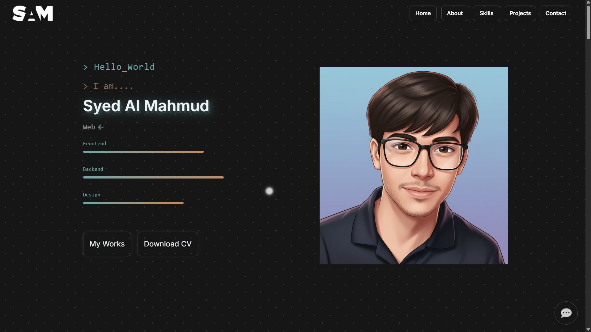
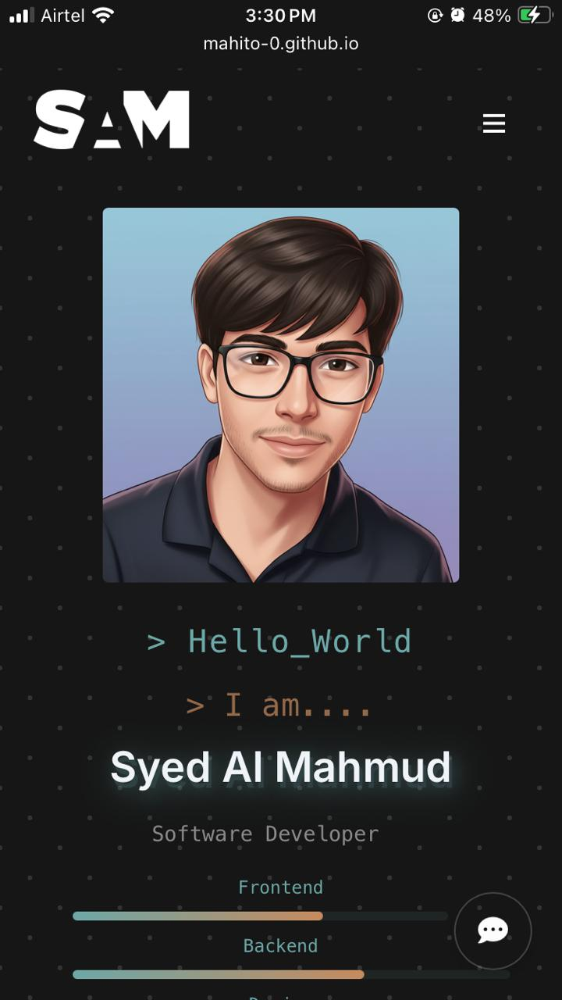

# 🌐 Personal Portfolio Website

<p align="center">
  
</p>

<p align="center">
  <a href="https://github.com/Syed-Al-Mahmud/Portfolio/commits/master">
    
  </a>
  <a href="https://github.com/Syed-Al-Mahmud/Portfolio/blob/master/LICENSE">
    
  </a>
  <a href="https://www.linkedin.com/in/syed-al-mahmud-45a671296/">
    
  </a>
  <a href="https://syed-al-mahmud.github.io/Portfolio/">
    
  </a>
</p>

Welcome to my **personal portfolio website**! This project represents my work, skills, and experiences in a clean, responsive, and interactive design. The goal of this portfolio is to provide a professional overview of who I am, showcase my projects, and make it easy for others to connect with me.

🔗 **Live Demo:** [Visit Portfolio](https://Syed-Al-Mahmud.github.io/Portfolio/)

## 📜 Table of Contents
- [Overview](#-overview)
- [Features](#-features)
- [Screenshots](#-screenshots)
- [Technologies Used](#-technologies-used)
- [Project Structure](#-project-structure)
- [Deployment](#-deployment)
- [Getting Started](#-getting-started)
- [Contributing](#-contributing)
- [Contact Me](#-contact-me)
- [License](#-license)
- [Support](#-support)

## 📌 Overview
- 🎨 Modern, responsive UI that works across all devices (desktop, tablet, mobile).
- 👨‍💻 About Me section to introduce myself and my journey.
- 💼 Projects showcase with descriptions and links.
- 📬 Contact section to make collaboration easier.
- 🚀 Lightweight and fast-loading design.

## ✨ Features
- **Responsive Design**: Fully responsive layout that adapts to any screen size.
- **Interactive Elements**: Engaging user interactions powered by JavaScript.
- **Project Showcase**: A dedicated section to display my work with links to live demos and source code.
- **Contact Form**: A functional contact form for easy communication.
- **Optimized Performance**: Fast loading times with optimized assets and clean code.
- **Fun Zone**: Includes a simple game for a bit of fun!

## 📸 Screenshots

| Desktop View | Mobile View |
|--------------|-------------|
|  |  |

## 🛠️ Technologies Used
This portfolio is built using front-end web technologies:

- **HTML5**: Structure of the website.
- **CSS3**: Styling, animations, and responsiveness.
- **JavaScript (Vanilla JS)**: Interactive elements and dynamic content.

## 📂 Project Structure
```
.
├── index.html          # Main landing page
├── styles.css          # Main stylesheet
├── script.js           # Main JavaScript file
├── pics.html           # Gallery page
├── work.html           # Work experience page
├── game.html           # A simple game
├── api/                # API related files
│   └── chat.js
├── assets/             # Site-wide assets
│   ├── chat-config.json
│   └── site-data.json
├── Files
│   ├── CV.pdf
│   ├── NanotechPoster.zip
│   └── ResearchPaper.zip
├── img/                # Image assets
│   ├── ... (images)
├── OTHER/              # Other projects and pages
│   ├── MSG.HTML
│   ├── msg.js
│   ├── style.css
│   └── ...
├── LICENSE             # MIT License file
└── README.md           # This file
```

## 🚀 Deployment
This website is deployed using **GitHub Pages**. The content of the `master` branch is automatically built and deployed.

## 🏁 Getting Started

If you want to run or edit this project locally:

1. **Clone the repository:**
   ```bash
   git clone https://github.com/Syed-Al-Mahmud/Portfolio.git
   ```
2. **Navigate into the project folder:**
    ```bash
    cd Portfolio
    ```
3. **Open `index.html` in your browser.**

That’s it! 🎉 You’ll have the site running locally.

## 🤝 Contributing

Contributions are welcome! If you have any suggestions or find any bugs, please open an issue or submit a pull request. 

1. Fork the Project
2. Create your Feature Branch (`git checkout -b feature/AmazingFeature`)
3. Commit your Changes (`git commit -m 'Add some AmazingFeature'`)
4. Push to the Branch (`git push origin feature/AmazingFeature`)
5. Open a Pull Request

## 📧 Contact Me
I’m always open to collaborations, opportunities, or just a friendly hello!

- 🌐 **Portfolio**: [mahito-0.github.io/Portfolio](https://mahito-0.github.io/Portfolio/)
- 🐙 **GitHub**: [mahito-0](https://github.com/mahito-0)
- 💼 **LinkedIn**: [Syed Al Mahmud](https://www.linkedin.com/in/syed-al-mahmud-45a671296/)
- ✉️ **Email**: [mahmud.agni@gmail.com](mailto:mahmud.agni@gmail.com)

## 📄 License
This project is licensed under the MIT License. See the [LICENSE](LICENSE) file for details.

## ⭐ Support
If you like this project, please star the repository on GitHub.
Your support motivates me to keep improving and building more projects. 🚀
